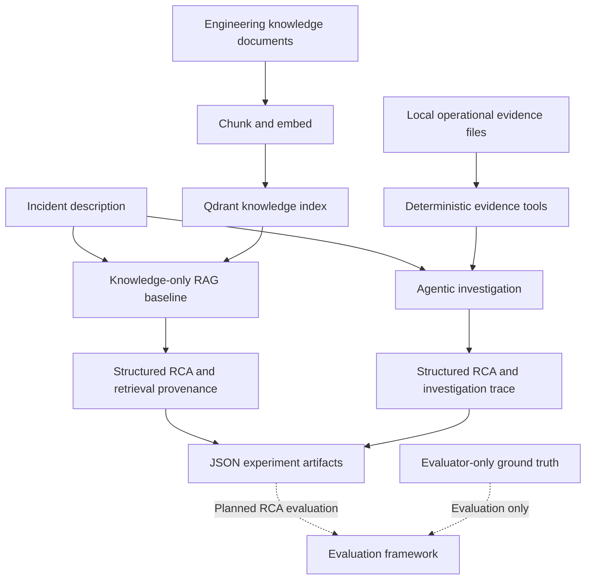
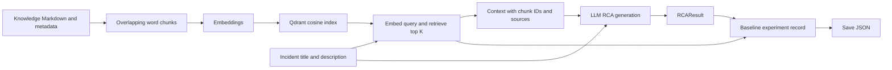
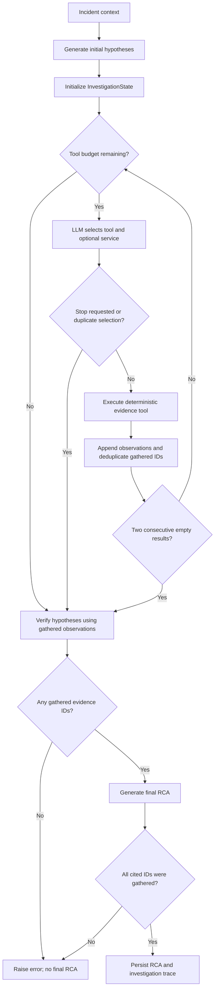

# TraceRoot architecture

## Purpose and scope

**TraceRoot — Evidence-Grounded Production Incident Investigator** asks:

> Can agentic evidence gathering improve root-cause identification and evidence grounding compared with knowledge-only RAG for software production incidents?

This guide describes the implementation through **TR-026**. It is a local, file-backed capstone experiment with two executable approaches and persisted outputs. It is not yet a completed comparative study. TR-025 and TR-026 are present in code and commit history. [The project board](../PROJECT_BOARD.md) tracks completed work and the remaining evaluation and delivery tasks.

## Simplified architecture

The two runtime paths have different evidence access by design. RAG retrieves general engineering documentation. The agent chooses operational evidence tools; it does not currently call the knowledge retriever. Ground truth has no input edge into either path. Retrieval evaluation already exists separately; the broader RCA evaluation framework is pending.

The implementation uses Python, Pydantic models, OpenAI model calls, and Qdrant for knowledge retrieval. Despite the historical ticket name “LangGraph Investigation State,” the current orchestration is ordinary Python functions and a bounded loop, not a LangGraph graph. MCP is an optional future integration.

## Data and experimental boundaries

| Data | Location | Consumer |
|---|---|---|
| Incident metadata | `data/incidents/INC-00X/incident.json` | Both approaches, with current prompt-field differences |
| Logs, metrics, deployments, code changes | Same incident directory | Agent through deterministic tools |
| General architecture and runbooks | `data/knowledge/` | RAG indexing and retrieval |
| Hidden root cause and evidence labels | `data/ground_truth/INC-00X.json` | Offline validation/evaluation only |
| Retrieval queries and relevant-source labels | `data/evaluation/retrieval_queries.json` | Separate retrieval evaluation |

Each incident directory contains `incident.json`, `logs.jsonl`, `metrics.json`, `deployments.json`, and `changes.json`. Operational entries have stable evidence IDs and include plausible distractors. `IncidentDataset` excludes ground truth, and runtime loaders/tools do not load the ground-truth files. This is a data-access contract, not an operating-system security boundary.

The current dataset consists of INC-001, INC-002, and INC-003. Keep evaluator answers out of prompts, tool observations, and the knowledge index. The general corpus describes the sample services; this document describes TraceRoot itself and is outside `data/knowledge/`.

## Knowledge-only RAG flow

1. Load and chunk general engineering documents, preserving source metadata and deterministic chunk IDs.
2. Embed chunks and store them in Qdrant. The supplied baseline script builds an in-memory index each run.
3. Retrieve top-K knowledge chunks using the incident title and description.
4. Ask the model for a structured RCA using only that incident text and retrieved knowledge, stating uncertainty when support is insufficient.
5. Store the RCA, retrieved chunk IDs/sources/scores, model, top-K, latency, and timestamp.

The baseline does not inspect operational files. Its `RCAResult.evidence_ids` is empty; knowledge retrieval provenance is stored separately and must not be counted as operational evidence citations.

Key entry points: `run_rag_baseline()` in `src/traceroot/baseline/rag.py` and `run_baseline_experiment()` in `src/traceroot/experiments/baseline.py`. `scripts/run_baseline.py` handles indexing and saving for INC-001.

## Agentic investigation flow

1. **Hypothesize:** generate up to three initial hypotheses from incident information, including `suspected_services`. They start as `OPEN`.
2. **Investigate:** the model chooses `logs`, `metrics`, `deployments`, or `code_changes`, optionally filtered by service. The dispatcher reads incident-scoped local files. Tools are deterministic and do not call an LLM or query live infrastructure.
3. **Record:** retain tool/service selection, selection reasoning, evidence IDs, and string observations. Later selections see the accumulated history.
4. **Stop:** enforce the tool-call budget (default six), an explicit model stop, duplicate `(tool_name, service)` prevention, or two consecutive empty results. Record `stop_reason` and `stop_reasoning`.
5. **Verify:** after the evidence-gathering loop, classify existing hypotheses as `OPEN`, `SUPPORTED`, or `REJECTED`. Verification is not interleaved after each tool call in the current runner.
6. **Synthesize:** produce a structured final RCA from incident context, assessed hypotheses, and gathered observations. Reject final citations that reference ungathered IDs. If no evidence was gathered, RCA generation raises an error.
7. **Persist:** save the successful agent experiment, including hypotheses, gathered IDs, tool history, stop information, final RCA, model, latency, and timezone-aware timestamp.

`run_agent_experiment()` in `src/traceroot/experiments/agent.py` orchestrates this sequence. `InvestigationState` holds the incident, hypotheses, gathered IDs, tool history, stop information, and optional final result.

## Shared output and meaning of “grounded”

Both paths return `RCAResult`: incident ID, root cause, affected service, evidence IDs, explanation, and optional confidence. Experiment records wrap this result with approach-specific provenance and execution metadata and are saved under `experiments/results/` by the README examples.

The agent validates that final cited IDs belong to the gathered set. This does **not** prove that the evidence causally supports the answer, that the root cause is correct, or that all necessary evidence was collected. The current validator also does not require a nonempty final citation list when evidence was gathered. Model confidence is self-reported, not calibrated accuracy.

A guardrail stop means investigation ended for a recorded reason; it does not mean the root cause was established. The persisted trace supports later analysis of early stops, missed evidence, and weak conclusions.

## Evaluation status and limitations

Implemented: evaluation schemas, a fixed 10-query retrieval benchmark, source-level Recall@K, functional tests, and experiment persistence. These are foundations for the study, not final comparative results.

Pending: root-cause accuracy, evidence precision/recall, faithfulness and relevancy evaluation, agent trace evaluation, broader efficiency instrumentation, a unified runner, comparative experiments, and failure analysis.

Before interpreting a RAG-versus-agent comparison:

- Use the same frozen incidents and keep ground truth evaluator-only. The intentional operational-evidence access difference is part of the research question.
- Resolve or explicitly control incident-field differences: the baseline uses title/description, while agent prompts include richer incident context, notably `suspected_services`.
- Evaluate retrieval separately from RCA. Recall@5 is weak evidence on a corpus of only five source documents.
- Account for current verification limits: assessments are matched by hypothesis description, and evidence citations are not enforced for hypothesis status changes. Assessment reasoning is not retained in the hypothesis state.
- Distinguish functional smoke runs from measured accuracy, and report failures as well as successful outputs. Do not infer agent superiority from individual examples.

TR-035 is planned to retain the three controlled synthetic incidents and add three OpenTelemetry Demo / Astronomy Shop-derived scenarios: ad service failure, email service memory leak, and cart service failure. These are planned scenario sources, not existing captured datasets or a live telemetry integration. Normalize future evidence into the same five-file incident contract, document provenance, keep truth separate, and freeze inputs before comparison. Evaluation should not require the demo to be running.

## Three-minute demo explanation

**Opening:** “TraceRoot compares knowledge-only RAG with an agent that gathers operational evidence. The research question is whether that gathering improves root-cause identification and grounding.”

**Architecture:** Show the first diagram. Explain the three data groups: general knowledge, incident evidence, and evaluator-only ground truth. Point out that each runtime has a deliberately different evidence path.

**Baseline:** Show the RAG flow. “It retrieves runbooks and architecture knowledge, then proposes an RCA. We preserve retrieval provenance, but it has not inspected this incident's operational evidence.”

**Agent:** Show the agent flow and a saved trace. “It forms hypotheses, selects tools, records observations, stops under explicit guardrails, assesses hypotheses, and generates an RCA with checked evidence IDs.” Point to the actual run's stop reason and the difference between gathered and finally cited IDs.

**Close:** “Both paths execute and persist outputs through TR-026. The comparative evaluation is still pending, so this demo demonstrates the investigation workflow, not proven accuracy gains.”

See [README](../README.md) for setup and runnable examples.
