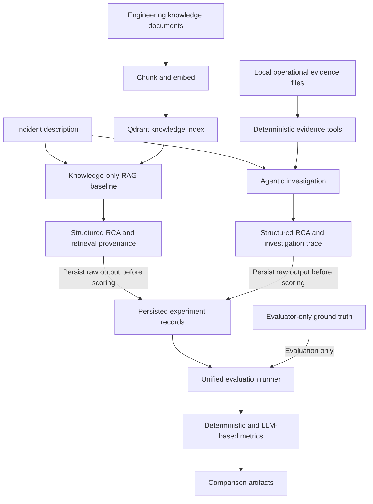
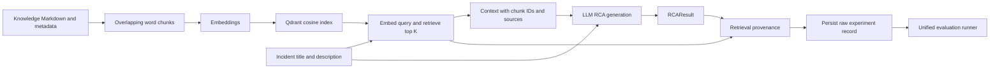
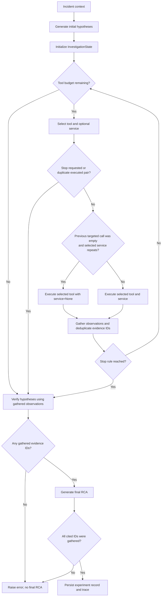

# TraceRoot architecture

## Purpose and first-release scope

**TraceRoot — Evidence-Grounded Production Incident Investigator** asks:

> Can agentic evidence gathering improve root-cause identification and evidence grounding compared with knowledge-only RAG for software production incidents?

This guide describes the first-release implementation through **TR-039**: knowledge-only RAG, agentic investigation with deterministic operational tools and guardrails, final RCA generation, trace persistence, unified evaluation, and runtime token/cost instrumentation. The reproducible evaluation uses a frozen six-incident dataset and includes pre- and post-TR-038 comparisons. See the [project board](../PROJECT_BOARD.md), [TR-037 failure analysis](TR037_FAILURE_ANALYSIS.md), and [TR-039 post-improvement evaluation](TR039_POST_IMPROVEMENT_EVALUATION.md) for implementation status and detailed findings.

## Simplified architecture



The runtime paths have different evidence access by design. RAG retrieves general engineering documentation. The Agent chooses operational evidence tools and does not call the knowledge retriever. Ground truth has no input edge into either runtime path. Raw RAG and Agent records are persisted before scoring; the unified runner then produces evaluation records and comparison summaries.

The implementation uses Python, Pydantic models, OpenAI model calls, and Qdrant for knowledge retrieval. Despite the historical ticket name “LangGraph Investigation State,” orchestration is a synchronous Python function and bounded loop, not a LangGraph graph. MCP is optional stretch work.

## Data and experimental boundaries

| Data | Location | Consumer |
|---|---|---|
| Incident metadata | `data/incidents/INC-00X/incident.json` | Both approaches, with the input-parity difference described below |
| Logs, metrics, deployments, code changes | Same incident directory | Agent through deterministic tools |
| General architecture and runbooks | `data/knowledge/` | RAG indexing and retrieval |
| Hidden root cause and evidence labels | `data/ground_truth/INC-00X.json` | Offline validation/evaluation only |
| Retrieval queries and relevant-source labels | `data/evaluation/retrieval_queries.json` | Separate retrieval evaluation |

The frozen evaluation set has six incidents. `INC-001` through `INC-003` are controlled synthetic incidents; `INC-004` through `INC-006` are synthetic/adapted scenarios based on OpenTelemetry Demo / Astronomy Shop failure modes. These are not captured production traces. OpenTelemetry Demo provides scenario provenance, not a runtime dependency; evaluation runs from local files and does not require a demo service to be running.

Each incident directory contains `incident.json`, `logs.jsonl`, `metrics.json`, `deployments.json`, and `changes.json`. Operational entries have stable evidence IDs and include plausible distractors. `IncidentDataset` excludes ground truth, and runtime loaders/tools do not load ground-truth files. Ground truth remains evaluator-only. This is a data-access contract, not an operating-system security boundary. Keep evaluator answers out of prompts, tool observations, and the knowledge index.

## Knowledge-only RAG flow



1. Load and chunk general engineering documents, preserving source metadata and deterministic chunk IDs.
2. Embed chunks and store them in Qdrant. The supplied baseline builds an in-memory index each run.
3. Retrieve knowledge using the incident title and description. The final comparative experiments use `top_k=3`.
4. Generate a structured RCA using only incident text and retrieved knowledge, expressing uncertainty when support is insufficient.
5. Persist the raw RCA and separate retrieval provenance before evaluation. Runtime input/output token counts, LLM call count, latency, and estimated cost are persisted when available.

The baseline does not inspect operational files. Its `RCAResult.evidence_ids` remains empty; knowledge retrieval provenance is separate and must not be counted as operational evidence citations.

Key entry points: `run_rag_baseline()` in `src/traceroot/baseline/rag.py` and `run_baseline_experiment()` in `src/traceroot/experiments/baseline.py`.

### Chunking and retrieval design

Knowledge documents are split by whitespace into overlapping word-based chunks. `chunk_document()` defaults to **600 words per chunk with 100 words of overlap**. It assigns deterministic chunk IDs from the document source and chunk index (`<source>::<chunk_index>`) and carries source and document metadata into each chunk and the indexed payload. The overlap preserves context across chunk boundaries, while the larger chunk keeps related material together; this is the implementation's simple fixed-size strategy, not a tuned optimum.

The configured embedding model is `text-embedding-3-small`, with 1536-dimensional vectors. Chunks are indexed in Qdrant using cosine similarity; each Qdrant point ID is a deterministic UUID5 derived from the chunk ID. The final comparative runs retrieve `top_k=3`.

## Agentic investigation flow



1. **Generate hypotheses:** create up to three initial hypotheses from incident information, including `suspected_services`. They start as `OPEN`.
2. **Select tool/service:** the model chooses `logs`, `metrics`, `deployments`, or `code_changes`, optionally filtered by service.
3. **Execute deterministic tool:** the dispatcher reads incident-scoped local files; tools do not call an LLM or query live infrastructure.
4. **Gather and deduplicate evidence:** append observations and add unseen evidence IDs to the investigation state. Tool history retains each call's observations and IDs.
5. **Apply stop rules:** the loop can end on the tool-call budget (default six), explicit model stop, duplicate `(tool_name, service)` pair, or two consecutive empty results.
6. **Verify hypotheses:** after evidence gathering, classify existing hypotheses as `OPEN`, `SUPPORTED`, or `REJECTED`. Verification is not interleaved after each tool call.
7. **Generate RCA:** synthesize a structured final RCA from the incident, assessed hypotheses, and gathered observations. If no evidence was gathered, RCA generation raises an error.
8. **Validate citations and persist:** reject final citations that reference IDs not gathered, then save the RCA, hypotheses, gathered IDs, tool history, stop information, model, execution measurements, and timestamp.

### TR-038 investigation change

TR-038 added prompt guidance to treat `suspected_services` as leads rather than guaranteed root causes, broaden after empty targeted searches, discourage repeated or overlapping tool/service choices, and prefer evidence that distinguishes hypotheses.

It also added a deterministic broadening guardrail. If the previous targeted tool call returned zero evidence and the next model selection targets the same service, the selected tool is executed with `service=None`; the tool type is preserved. This is conditional behavior, not a guarantee that broadening always occurs. Duplicate detection uses the actual executed `(tool_name, service)` pair, and `ToolCallRecord.service` stores that actual executed service.

`run_agent_experiment()` in `src/traceroot/experiments/agent.py` orchestrates the sequence. `InvestigationState` holds incident context, hypotheses, gathered IDs, tool history, stop information, and optional final result.

## Shared output and grounding

Both paths return `RCAResult`: incident ID, root cause, affected service, evidence IDs, explanation, and optional confidence. Experiment records wrap the result with approach-specific provenance and execution metadata.

The Agent validates that final cited IDs belong to the gathered set. Membership does not prove that evidence causally supports the answer, the root cause is correct, or all necessary evidence was collected. The validator also does not require a nonempty final citation list when some evidence was gathered. Model confidence is self-reported, not calibrated accuracy. Hypothesis verification still matches assessments using hypothesis descriptions rather than stable hypothesis IDs, and assessment reasoning is not retained in hypothesis state.

## Evaluation architecture

`src/traceroot/evaluation/comparison.py` coordinates the per-incident comparison. It persists raw approach records before loading ground truth and scoring. The unified evaluation runner reads each persisted result with evaluator-only ground truth, then persists per-approach evaluation records; comparison summaries aggregate the results.

| Approach | Metrics |
|---|---|
| RAG | Root Cause Accuracy, Faithfulness, Relevancy |
| Agent | Root Cause Accuracy, Evidence Precision, Evidence Recall, Faithfulness, Relevancy, Tool Efficiency, Empty Tool Rate, Evidence Coverage, Stop Quality |

Root Cause Accuracy, Faithfulness, and Relevancy use LLM-based evaluation. Evidence and trace metrics are deterministic for a given saved record and ground truth.

Execution metrics are recorded alongside quality metrics:

- Latency
- LLM calls
- Tool calls
- Investigation steps
- Input, output, and total tokens
- Estimated runtime cost

RAG has no operational tool calls; Agent tool calls and investigation steps reflect its recorded tool history. Runtime cost describes instrumented experiment-generation calls. If evaluator/judge calls are not included in execution metrics, their cost is separate and must not be represented as part of persisted runtime cost.

### Comparison persistence

```text
experiments/comparison/
├── raw/
├── evaluations/
└── summary.json

experiments/comparison-post-tr038/
├── raw/
├── evaluations/
└── summary.json
```

The `raw/` records preserve generated outputs before scoring; `evaluations/` stores per-incident metric results. The two comparison directories hold the pre- and post-TR-038 runs on the frozen incident set.

## Measured status and limitations

Initial six-incident comparison:

| Measure | RAG | Agent |
|---|---:|---:|
| Mean RCA accuracy | ~0.477 | ~0.771 |
| Mean latency | ~3.18 s | ~15.63 s |
| Mean runtime cost | ~$0.00158 | ~$0.01164 |

Post-TR-038 deterministic Agent metrics:

| Metric | Pre | Post |
|---|---:|---:|
| Evidence precision | 0.405 | 0.486 |
| Evidence recall | 0.744 | 0.867 |
| Evidence coverage | 0.800 | 0.867 |
| Empty-tool rate | 0.306 | 0.225 |
| Stop quality | 0.250 | 0.583 |

The post-run LLM-judged Agent RCA mean was lower (0.614 vs 0.771), but this single-run result should not be attributed directly to TR-038. Unchanged RAG scores also varied substantially between runs. Deterministic evidence/trace metrics and manual trace inspection provide the strongest evidence for conclusions about TR-038. Improved evidence gathering does not guarantee improved final RCA synthesis.

Interpret results in light of these limitations:

- The evaluation has `n=6` incidents in a synthetic/adapted frozen dataset.
- There is one pre-improvement and one post-improvement run.
- LLM generation is stochastic, and the LLM judge is stochastic.
- Inputs are not fully at parity: RAG uses title/description, while the Agent receives richer incident context, including `suspected_services` when present.
- Hypothesis verification still uses descriptions instead of stable IDs.
- Evidence-ID membership does not establish causal correctness or completeness.
- Better evidence gathering does not guarantee better RCA synthesis.
- Persisted runtime cost may exclude evaluator calls; evaluator-call cost is separate when it is not included.

These are descriptive capstone results, not a claim of statistical significance or general production performance. Detailed incident findings and evaluation caveats are in the [TR-037 analysis](TR037_FAILURE_ANALYSIS.md) and [TR-039 report](TR039_POST_IMPROVEMENT_EVALUATION.md).

## Architecture trade-offs

- **Synchronous Python loop instead of LangGraph:** the current investigation flow is small and bounded; introducing graph orchestration was not necessary for the experiment.
- **Deterministic operational tools:** deterministic lookups isolate Agent reasoning from evidence retrieval behavior and make evaluation reproducible.
- **File-backed evidence:** frozen local fixtures make evaluation reproducible without depending on external-system availability.
- **Qdrant and embeddings for RAG:** semantic retrieval over the small engineering knowledge corpus provides relevant context while preserving retrieval provenance.
- **Separate RAG and Agent evidence paths:** RAG uses general engineering knowledge while the Agent gathers operational evidence, directly testing knowledge-only reasoning versus operational evidence gathering.
- **Future adapters:** live observability, deployment, and code integrations can be added behind the existing tool contracts; they are not part of this release.
- **MCP:** remains optional stretch work and is not required for the first-release evaluation.

### File-backed evaluation vs production adapters

Current evaluation uses frozen local evidence through the existing tool contracts:

```text
Frozen JSON evidence
    ->
existing TraceRoot tool contracts
    ->
agent investigation
```

A future production mode could preserve the same investigation workflow while adapters connect live systems to those contracts:

```text
live logs / metrics / traces / deployment / Git systems
    ->
adapters
    ->
same TraceRoot tool contracts
    ->
same investigation workflow
```

Potential adapter sources include Splunk, CloudWatch, or Elasticsearch for logs; Prometheus, Datadog, or Grafana-compatible sources for metrics; OpenTelemetry for traces; Kubernetes, Argo CD, or CI/CD systems for deployments; and GitHub or GitLab for code changes. These live integrations are **not implemented** in the current first release.

## Three-minute demo explanation

1. **Opening:** introduce the research question: whether agentic evidence gathering improves root-cause identification and evidence grounding compared with knowledge-only RAG.
2. **Architecture:** distinguish general engineering knowledge, operational incident evidence, and evaluator-only ground truth.
3. **RAG and Agent:** show RAG retrieving engineering knowledge and producing an RCA, then the Agent flow from hypotheses through tool calls and gathered evidence to an RCA.
4. **Trace and comparison:** inspect one persisted investigation trace, then show the initial RAG-versus-Agent results and the latency/runtime-cost trade-off.
5. **Failure analysis and TR-038:** share an insight such as INC-002 gathering no labeled evidence while repeatedly targeting checkout-service; explain the prompt guidance and conditional broadening guardrail.
6. **Post-improvement results:** show the deterministic evidence precision, recall, coverage, empty-tool rate, and stop-quality changes. Note the Agent quality/cost/latency trade-off and that the single-run RCA score does not establish an improvement.
7. **Close:** better evidence gathering did not consistently translate into better final RCA synthesis.

See the [README](../README.md) for setup and runnable examples.
