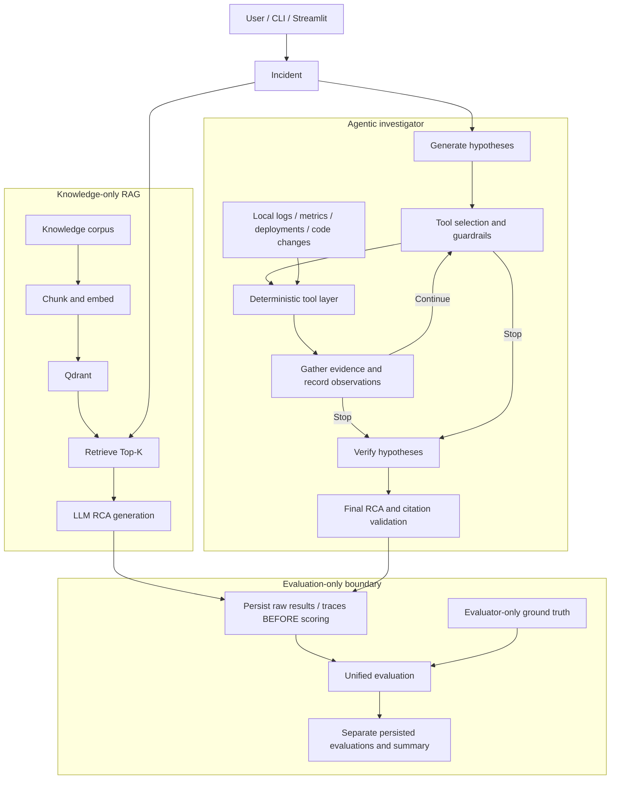
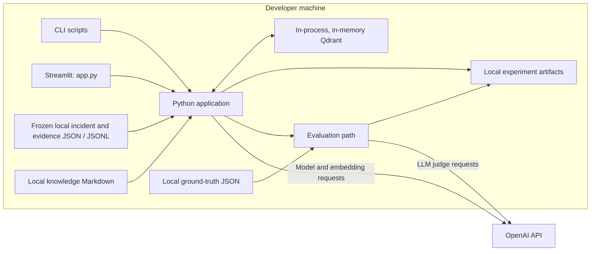
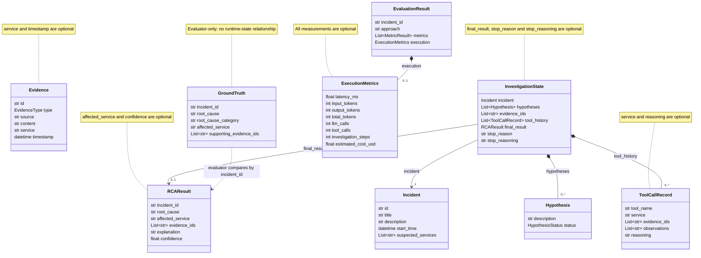
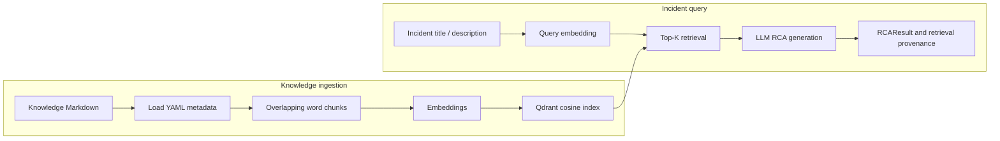
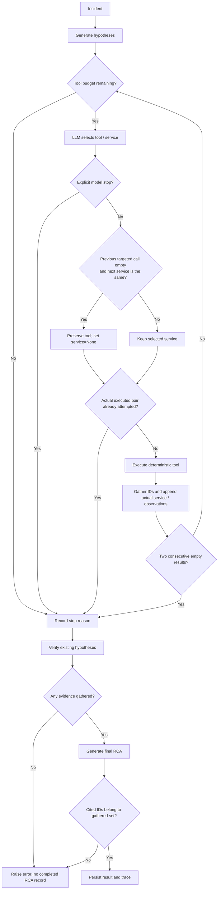
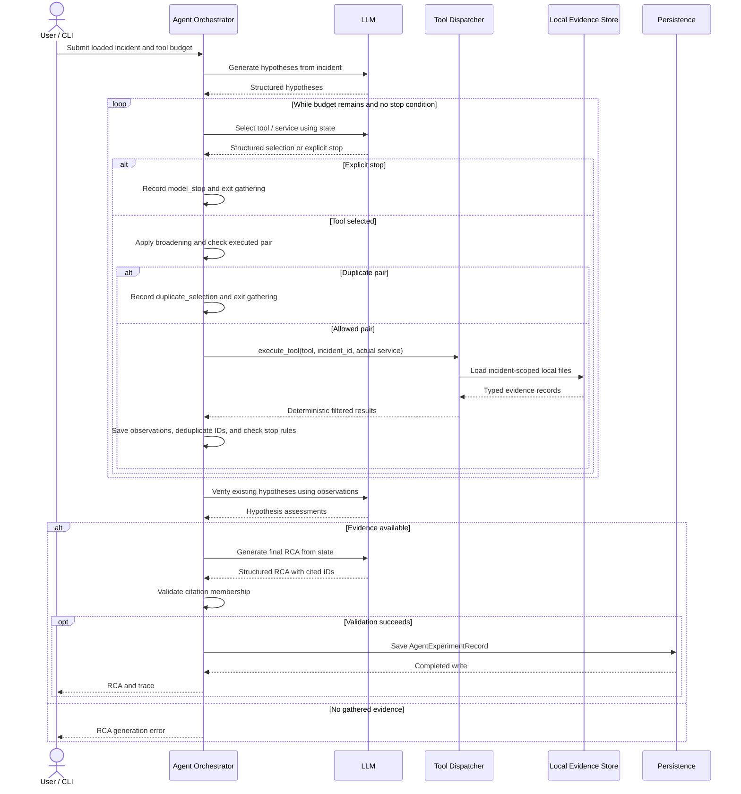
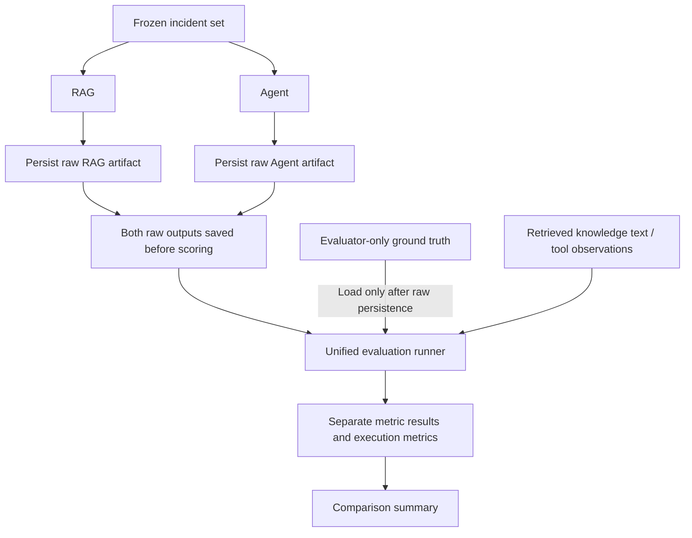
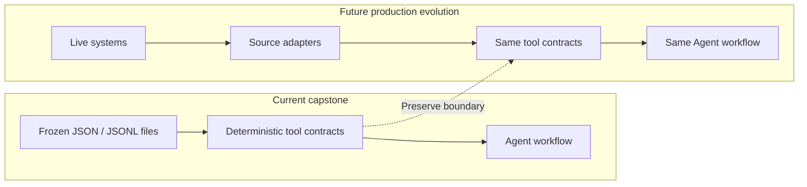

# TraceRoot System Design

## 1. Overview

TraceRoot is an evidence-grounded production incident investigator that compares knowledge-only RAG with an Agent that gathers operational evidence.

**Research question:**

> Can agentic evidence gathering improve root-cause identification and evidence grounding compared with knowledge-only RAG for software production incidents?

The first release is a local, controlled capstone experiment over six frozen synthetic/adapted incidents. RAG retrieves general engineering knowledge; the Agent investigates incident-specific logs, metrics, deployments, and code changes. **Ground truth is evaluator-only and never enters either runtime context.** The Agent does not call the knowledge retriever.

Reading guide: [README](../README.md), [Architecture](ARCHITECTURE.md), [Capstone Report](CAPSTONE_REPORT.md), [Dataset Provenance](DATASET_PROVENANCE.md), [TR-037 Failure Analysis](TR037_FAILURE_ANALYSIS.md), and [TR-039 Post-Improvement Evaluation](TR039_POST_IMPROVEMENT_EVALUATION.md). This document focuses on implemented architecture; section 13 explicitly describes future evolution.

## 2. Requirements

### 2.1 Functional Requirements

| Capability | Implemented behavior |
|---|---|
| Load an incident | Validate local incident JSON as `Incident`; load operational fixtures as `IncidentDataset`. |
| Run knowledge-only RAG RCA | Retrieve engineering knowledge and generate a structured RCA with retrieval provenance. |
| Generate Agent hypotheses | Generate up to three initial hypotheses by default from incident context. |
| Select operational tools | LLM selects a tool and optional service, or requests a stop. |
| Gather evidence | Deterministic queries return logs, metrics, deployments, and code changes. |
| Enforce guardrails | Bound queries, broaden conditionally, prevent duplicate executed pairs, and stop after two empty results. |
| Verify hypotheses | Classify existing hypotheses as open, supported, or rejected after investigation. |
| Generate final RCA | Synthesize gathered observations and validate cited evidence IDs. |
| Persist results and traces | Save experiment records; comparison additionally saves evaluations and a summary. |
| Evaluate both approaches | Unified runner combines LLM-based quality metrics with deterministic Agent evidence/trace metrics. |
| Expose demos | Agent CLI, baseline/comparison scripts, and Streamlit Agent UI with optional completed-result evaluation. |

The Streamlit new-incident form exists, but supplies an empty temporary evidence dataset. The current RCA generator rejects investigations with no gathered evidence; this form does not provide a working live-evidence investigation path.

### 2.2 Non-Functional Requirements

| Concern | Current mechanism and boundary |
|---|---|
| Reproducibility | Frozen fixtures, fixed comparison configuration, stable IDs, and saved outputs; LLM outputs are still stochastic. |
| Deterministic evidence access | Local typed records and explicit filters; tools contain no LLM calls. |
| Evidence provenance | Operational IDs and per-call observations; RAG chunk IDs, sources, and similarity scores. |
| Ground-truth isolation | Runtime loaders omit truth; comparison loads labels only after both raw records are saved. This is an application boundary, not an OS security boundary. |
| Bounded Agent execution | Default six-tool-call budget, counting existing history; does not constitute a wall-clock timeout or a six-LLM-call limit. |
| Trace observability | Executed tool/service, reasoning, observations, IDs, hypothesis statuses, and stop details in JSON. |
| Cost and latency measurement | Instrumented generation usage, elapsed runtime, and estimated token-based cost. |
| Testability | Typed Pydantic contracts, mocked model calls, deterministic tool tests, and in-memory Qdrant tests under `tests/`. |

### 2.3 Out of Scope for First Release

- Live production telemetry integration.
- Production incident intake integrations.
- Production deployment.
- MCP integration.
- Distributed orchestration.
- Real-time multi-user scale.

## 3. High-Level Architecture



| Component | Responsibility |
|---|---|
| Entry points and incident loading | Select local incident input and invoke the relevant workflow; the UI exposes Agent investigation. |
| RAG | Index general Markdown knowledge, retrieve context, and generate an RCA without operational evidence. |
| Agent | Decide which evidence to inspect, maintain state, verify hypotheses, and synthesize an RCA. |
| Tool layer | Read incident-scoped fixtures with optional service filtering; return original typed evidence. |
| Persistence | Save generated results and provenance before evaluators can score them. |
| Evaluation | Compare completed outputs with hidden labels and observed context; store scores separately. |

The two branches show logical data flow. The comparison implementation executes RAG and then Agent sequentially, not concurrently. There is no runtime edge from ground truth to either branch.

## 4. Current Deployment / Runtime Topology



`scripts/run_baseline.py` and `src/traceroot/evaluation/comparison.py` instantiate `QdrantClient(":memory:")`: **no Qdrant server is required**. The Agent-only path does not need Qdrant. Evidence tools read local files; OpenTelemetry Demo supplies scenario provenance and is **not a runtime dependency**. This is a local application topology, not a deployed service architecture.

## 5. Core Component Design

Paths below are relative to the repository root.

| Component | Actual modules and symbols | Design responsibility |
|---|---|---|
| Incident Loader | `src/traceroot/data/loader.py`: `load_incident()`, `load_incident_dataset()`; `domain/incident.py`: `Incident`; `data/models.py`: `IncidentDataset` (under `src/traceroot/`) | Parse incident and evidence fixtures. Neither model contains ground truth. |
| RAG Pipeline | `src/traceroot/rag/loader.py`: `load_knowledge_corpus()`; `chunker.py`: `chunk_document()`; `embeddings.py`: `embed_text()`, `embed_texts()`; `index.py`: `create_knowledge_collection()`, `index_chunks()`; `retriever.py`: `retrieve()` (all latter files under `src/traceroot/rag/`) | Load metadata, chunk, embed, index, and retrieve knowledge. |
| RAG RCA generator | `src/traceroot/baseline/rag.py`: `run_rag_baseline()`, `generate_rca()`, `RAGBaselineResult` | Build incident/context prompts and return `RCAResult` plus retrieval results. |
| Agent Orchestrator | `src/traceroot/experiments/agent.py`: `run_agent_experiment()`; `src/traceroot/agent/state.py`: `InvestigationState`; `hypothesis.py`: `generate_hypotheses()`; `investigation.py`: `investigate()`; `verification.py`: `verify_hypotheses()`; `rca.py`: `generate_final_rca()` (latter files under `src/traceroot/agent/`) | Run the synchronous hypothesis → investigation → verification → synthesis sequence. |
| Deterministic Tool Layer | `src/traceroot/tools/logs.py`: `query_logs()`; `metrics.py`: `query_metrics()`; `deployments.py`: `query_deployments()`; `changes.py`: `query_code_changes()`; `interface.py`: `ToolName`, `execute_tool()` (latter files under `src/traceroot/tools/`) | Dispatch incident/service queries to typed local records. The dispatcher exposes service filtering; underlying logs/metrics functions support additional filters. |
| Persistence Layer | `src/traceroot/experiments/models.py`: `BaselineExperimentRecord`, `AgentExperimentRecord`, `RetrievedKnowledge`; `src/traceroot/experiments/persistence.py`: `persist()`, `save_baseline_record()`, `save_agent_experiment_record()` | Serialize JSON and create parent directories. Store baseline provenance or Agent trace, result, model, timestamp, and usage. |
| Comparison and summaries | `src/traceroot/evaluation/comparison.py`: `run_incident_comparison()`; `scripts/run_comparison.py`: `main()` | Save raw/evaluation artifacts; write configuration, results, and failures into `summary.json`. |
| Evaluation Layer | `src/traceroot/evaluation/runner.py`: `evaluate_rag_record()`, `evaluate_agent_record()`; metric modules `root_cause_accuracy.py`, `faithfulness.py`, `relevancy.py`, `evidence.py`, `agent_trace.py`, `efficiency.py` in that package | Apply LLM metrics, deterministic evidence/trace metrics, and execution accounting. |

## 6. Data Model

The diagram shows verified fields, using `List` for list types and notes for optional values. `Evidence` is a domain model; the current tools return `LogEntry`, `MetricEntry`, `DeploymentEntry`, and `CodeChangeEntry`, not `Evidence` instances.



`HypothesisStatus` is `open`, `supported`, or `rejected`; initial status is `open`. Evidence references are string IDs, not embedded domain `Evidence` objects. `GroundTruth` is supplied to evaluation functions, not stored inside `InvestigationState` or `EvaluationResult`.

## 7. Knowledge-Only RAG Design



| Design parameter | Verified implementation |
|---|---|
| Chunking | `chunk_document()` defaults to **600 words**, **100-word overlap**, using whitespace splitting; comparison uses these defaults. |
| Chunk identity | Deterministic `<source>::<chunk_index>`; source is the Markdown filename. |
| Preserved metadata | `source`, `document_type`, `service`, `topic`, `chunk_index`; content and chunk ID also stored in Qdrant payload. |
| Embeddings | Default `text-embedding-3-small`; index dimension **1536**. The embedding model is environment-configurable, but index dimensions remain fixed. |
| Index | Collection `traceroot_knowledge`, cosine similarity, point IDs from `uuid5(NAMESPACE_URL, chunk.id)`; stable IDs support repeatable upserts. |
| Retrieval | Embed title plus description; preserve similarity score and reconstruct chunk from payload. |
| Final comparison | `top_k=3`; the standalone baseline script and baseline/retriever function defaults use `5`. |
| Generation | `gpt-5.4-mini` structured RCA; context includes chunk IDs and source names. |
| Provenance | `RetrievedKnowledge` stores chunk ID, source, and score; operational `RCAResult.evidence_ids` stays empty. |

This baseline uses general knowledge only. It never inspects incident-specific operational evidence, and its generation prompt uses title/description rather than the Agent's richer incident object.

## 8. Agent Investigation Design



| Stop condition | Emitted `stop_reason` | Behavior |
|---|---|---|
| Explicit model stop | `model_stop` | End gathering before executing another tool. |
| Tool-call budget | `tool_budget_exhausted` | Default six queries; existing history consumes the budget. |
| Duplicate executed pair | `duplicate_selection` | Reject an already attempted `(tool_name, service)` after broadening is resolved. |
| Two consecutive empty results | `consecutive_empty_results` | End after two consecutive calls returning no records in this invocation. Nonempty output resets the counter. |

**TR-038:** prompt guidance treats `suspected_services` and hypotheses as leads, not guaranteed causes; it encourages broadening after empty targeted searches and evidence that distinguishes alternatives. The deterministic rule applies only when the immediately previous call targeted a service, returned zero evidence, and the next selection targets that same service. It preserves the selected tool and changes its service to `None`.

Duplicate detection checks the **actual executed tool/service pair** after this rewrite. `ToolCallRecord.service` records the actual service. The rule does not always fire, and a broadened pair can itself be blocked as a duplicate. Verification occurs once after gathering; it updates existing hypothesis statuses by matching descriptions.

## 9. Sequence Diagram — Agent Investigation



Model calls handle reasoning and synthesis. Dispatcher calls perform deterministic lookups, with no model involvement. Invalid structured outputs or unknown final citation IDs raise errors rather than producing a completed experiment record.

## 10. Evaluation Architecture



`run_incident_comparison()` in `src/traceroot/evaluation/comparison.py` saves raw RAG and Agent outputs before loading ground truth, without manual correction. It passes the same completed record objects to `evaluate_rag_record()` and `evaluate_agent_record()` in `src/traceroot/evaluation/runner.py`; the current path does not reload those JSON records for scoring. RAG context is reconstructed from retrieved chunk IDs and the loaded corpus.

| Approach | Metrics |
|---|---|
| RAG | Root Cause Accuracy, Faithfulness, Relevancy |
| Agent | Root Cause Accuracy, Evidence Precision, Evidence Recall, Faithfulness, Relevancy, Tool Efficiency, Empty Tool Rate, Evidence Coverage, Stop Quality |

| Metric family | Meaning and implementation boundary |
|---|---|
| LLM-based | DeepEval `GEval`, `FaithfulnessMetric`, and `AnswerRelevancyMetric`; evaluate the `root_cause` text. Faithfulness uses retrieved knowledge for RAG and tool observations for Agent. |
| Evidence Precision / Recall | Set overlap between final cited IDs and ground-truth supporting IDs; deterministic. |
| Tool Efficiency | Unique executed tool/service pairs divided by executed calls; not information gain. |
| Empty Tool Rate | Fraction of executed calls returning zero IDs. |
| Evidence Coverage | Fraction of labeled supporting IDs gathered, regardless of final citation selection. |
| Stop Quality | Deterministic category score, not proof of investigative completeness. |

Current Stop Quality maps `model_stop` to 1, `duplicate_selection` and `two_empty_results` to 0.5, and `tool_budget_exhausted` to 0. The Agent actually emits `consecutive_empty_results`, which falls through to 0. This documents the current evaluator unchanged.

`ExecutionMetrics` records latency, LLM calls, tool calls, investigation steps, input tokens, output tokens, total tokens, and estimated runtime cost. Agent tool calls and steps equal history length; RAG has zero tool calls and no populated investigation-step value. Missing usage stays optional rather than becoming a fabricated zero.

Deterministic metrics are preferred where possible for repeatable evidence/trace assessment. Ground truth is used only in evaluation (and offline dataset validation), never in generation. Separate retrieval evaluation also exists in `src/traceroot/evaluation/retrieval.py` and `retrieval_metrics.py`; it is not an extra metric in the RCA comparison runner.

## 11. Storage and Artifact Layout

```text
data/
  incidents/                    # Incident JSON and operational evidence fixtures
  knowledge/                    # General Markdown knowledge with YAML metadata
  ground_truth/                 # Evaluator-only causes and supporting evidence IDs
  evaluation/                   # Retrieval benchmark queries and source labels

experiments/
  comparison/                   # Initial frozen comparison
    raw/                        # <incident>-rag.json and <incident>-agent.json
    evaluations/                # Per-approach <incident>-*-eval.json
    summary.json                # Configuration, successful results, failures
  comparison-post-tr038/        # Post-improvement run, same layout
    raw/
    evaluations/
    summary.json
  results/                      # Standalone baseline / Agent output
    ui/                         # Unique filenames for completed UI investigations

docs/                           # Architecture, provenance, and analysis
```

Each incident directory contains `incident.json`, `logs.jsonl`, `metrics.json`, `deployments.json`, and `changes.json`. Ground truth is stored separately. JSON persistence creates parent directories and writes the requested path; standalone CLI reruns overwrite the same incident's output. These are local files, not a transactional artifact database.

## 12. Reliability and Guardrails

| Guardrail | Guarantee | Limit |
|---|---|---|
| Bounded tool budget | Caps executed evidence queries; counts existing history. | Does not cap request latency or all LLM calls. |
| Duplicate prevention | Blocks repeated actual tool/service pairs, including empty prior calls. | Different pairs can return overlapping evidence. |
| Two-empty-result stop | Stops unproductive consecutive calls. | Empty results do not prove absence of a cause. |
| Explicit model stop | Allows early termination with stored reasoning. | Model confidence about completeness may be wrong. |
| Evidence ID deduplication | Excludes IDs already gathered when adding subsequent tool results. | Per-call history retains overlapping observations. |
| Final ID membership validation | Rejects citations not in the gathered set; rejects RCA generation without gathered evidence. | Membership does not prove causal correctness; a nonempty final citation list is not enforced. |
| Ground-truth isolation | Runtime loaders and prompts exclude evaluator labels. | Application-level separation within a shared local filesystem. |
| Deterministic execution | Same fixture and filters give the same evidence. | LLM tool selection and causal interpretation remain stochastic. |
| Persisted trace | Completed runs preserve observations, executed selections, and stop details. | No per-step durable checkpoint; interrupted/failed runs need not have a completed trace. |

A guardrail stop does not establish RCA correctness. The comparison script records an incident failure and continues remaining incidents; it returns a nonzero exit status when failures exist. Persistence precedes scoring, so completed raw outputs survive a subsequent evaluator failure.

## 13. Scaling and Production Evolution

**Future proposal only:** none of the live adapters below currently exists in TraceRoot.



| Evidence surface | Potential adapter sources |
|---|---|
| Logs | Splunk / CloudWatch / Elasticsearch |
| Metrics | Prometheus / Datadog / Grafana-compatible sources |
| Traces | OpenTelemetry; there is currently no trace tool in `ToolName`. Mapping to existing records or extending the contract would require design work. |
| Deployments | Kubernetes / Argo CD / CI/CD |
| Code changes | GitHub / GitLab |

Adapters could translate source responses into stable, incident-scoped evidence records behind the dispatcher, preserving the Agent/tool boundary. Live responses would require a defined incident/time scope and evidence snapshots to retain reproducibility; deterministic local lookup does not imply deterministic live telemetry.

Production evolution would also need measured capacity targets, durable execution/artifact storage, concurrency control, retries/timeouts, access controls, and telemetry data handling. These are future requirements, not implemented infrastructure or current scale guarantees. Distributed orchestration and multi-user operation remain out of scope for this release.

## 14. Key Design Trade-offs

| Decision | Why | Trade-off |
|---|---|---|
| Synchronous Python loop vs LangGraph | Small, bounded investigation is straightforward to inspect and test. | No graph runtime, durable resume, or distributed scheduling. |
| Deterministic tools vs LLM-generated evidence | Preserve actual fixture content, stable IDs, and auditability. | Reasoning remains probabilistic; fixture coverage limits conclusions. |
| File-backed evidence vs live integrations | Reproducible experiments independent of external availability. | Does not validate production integration complexity or telemetry scale. |
| Knowledge-only RAG vs Agent operational access | Directly tests the value of incident-specific evidence gathering. | Evidence access intentionally differs; richer Agent input also limits comparison parity. |
| Qdrant semantic retrieval | Retrieve knowledge by meaning and retain source provenance. | Embedding calls and index setup add work; small corpus limits retrieval benchmark discrimination. |
| Bounded investigation budget | Limits evidence-query work and cost exposure. | May stop before finding causal evidence. |
| Persistence before scoring | Retain generated outputs independently of evaluator results. | Local JSON writes offer no transaction or crash-recovery protocol. |
| LLM RCA evaluation vs deterministic evidence metrics | Semantic judging handles paraphrases; set/trace metrics are repeatable. | Judges vary; evidence-label overlap and stop categories do not prove correctness. |

## 15. Performance and Cost Characteristics

Measured from the saved six-incident comparisons, using `gpt-5.4-mini`, RAG `top_k=3`, and Agent `max_tool_calls=6`:

| Measure | Initial RAG | Initial Agent | Post-TR-038 Agent |
|---|---:|---:|---:|
| Mean recorded latency | ~3.18 s | ~15.63 s | ~15.18 s |
| Mean estimated runtime cost | ~$0.00158 | ~$0.01164 | ~$0.01545 |
| Mean tool calls | 0 | 4.00 | 4.50 |
| Mean LLM calls | 1.00 | 7.50 | 8.33 |

The Agent's additional reasoning stages and evidence context bring more calls and higher cost. Broader search can improve evidence quality while increasing token usage and runtime cost; improved gathering does not guarantee improved final RCA quality. Latency was roughly similar in this specific post run, not evidence of a general speed improvement.

Accounting covers instrumented generation/investigation calls using repository pricing constants. Corpus ingestion and embedding cost and evaluator/judge calls are not included in recorded runtime cost. Baseline latency includes retrieval/query embedding and generation, but excludes preceding corpus indexing; Agent latency covers its orchestration through synthesis before persistence. These are experimental measurements, not production SLOs or universal performance conclusions. See [TR-037](TR037_FAILURE_ANALYSIS.md) and [TR-039](TR039_POST_IMPROVEMENT_EVALUATION.md) for analysis.

## 16. Known Limitations

- Only six incidents, with synthetic/adapted evidence and no live telemetry.
- One pre-improvement and one post-improvement run; no statistical significance claim.
- Both LLM generation and the LLM judge are stochastic.
- RAG receives title/description; Agent receives richer incident context including `suspected_services`.
- Hypothesis verification matches descriptions instead of stable IDs; assessment reasoning is not retained in hypothesis state.
- Evidence membership is not causal correctness; labeled supporting sets may omit useful contextual evidence.
- Better evidence gathering does not guarantee better final RCA synthesis.
- Tool Efficiency measures unique executed pairs, not information gain; Stop Quality has the label mismatch described in section 10.
- Completed traces do not include durable intermediate checkpoints or the rejected duplicate-selection payload.
- New UI incidents lack operational evidence and cannot complete RCA generation under the current no-evidence guardrail.
- Local synchronous execution, in-memory indexing, and filesystem artifacts do not establish multi-user scalability or production readiness.

## 17. Final Architecture Summary

TraceRoot intentionally separates:

- General knowledge retrieval.
- Operational evidence gathering.
- Evaluator-only truth.

The main design objective is to make the comparison reproducible and auditable while keeping the investigation workflow extensible to future live adapters.
